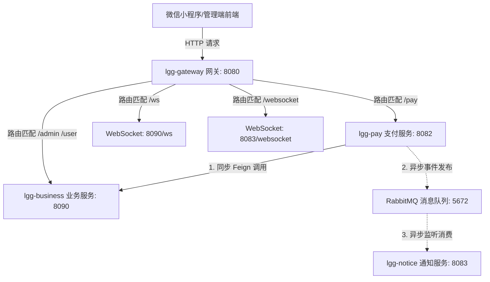
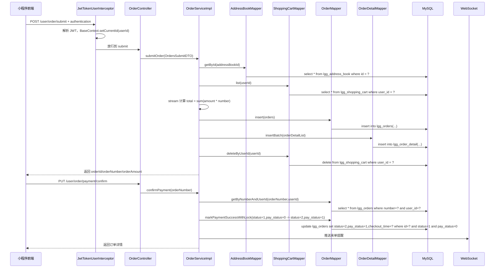
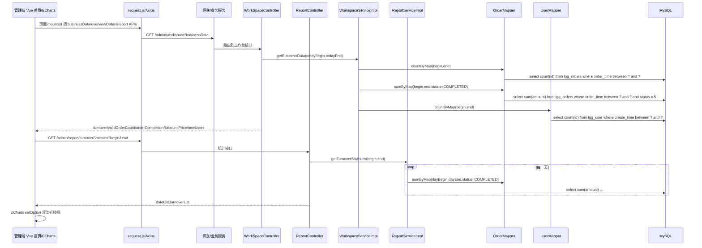

# 后端系统扫描分析与当前信息阻塞项报告 (issue.md)

## 🔴 当前信息阻塞项 (Blocking Issues)

1. **管理端首页数据 Mock 状态**: 前端 `/src/views/index.vue` 中所有关键销售指标、订单状态占比、热销水果排名均为硬编码静态 Mock 数据，无法展示系统的实时运营成果。
2. **缺少可视化图表组件**: 首页缺乏直观展示商业财务趋势、用户增长及热销水果品类的商业折线图、饼图与柱状图。
3. **多微服务下的 WebSocket 端口路由适配**: 本地部署时，由于 `lgg-business` (Port 8090) 与 `lgg-notice` (Port 8083) 分别维护了独立的 WebSocket 连接句柄，前端连接需要根据网关路由或不同微服务端口进行精准匹配转发，若网关拦截未完全放行，可能导致握手失败（401/403）。

## 🔴 当前业务细节与逻辑边界疑问 (Business Logical Issues)

1. **骑手多订单并单指派限制**: 当后台管理员向骑手分派订单时，是否允许同一个骑手同时接多个单？指派数量是否存在上限设置？
2. **WebSocket 离线消息提醒机制**:
   - 当用户进行了特定操作（如下单/催单）触发 Web 端 WebSocket 消息播报时，如果管理员在 Admin 后台处于退出（Logout）或浏览器关闭状态，此消息通知是否会一直提醒（或在下次登录时补发），还是说该条消息会直接丢失/消失？
   - 如果管理员手动点击“关闭消息通知”，在此之后发生的订单催单情况，管理员是否就完全无从得知，系统是否缺乏兜底的离线提醒（如短信/微信推送）？
3. **多骑手防并发抢单控制**: 如果系统中存在多个骑手，是否允许他们对同一个订单进行抢单？在抢单瞬间是否设计了乐观锁或分布式锁防止多人重复抢单成功的并发冲突？

---

## 🟢 后端系统全盘扫描与深度解答

### 1. 数据库、数据表与实体关系 (Tables, Entities & Relationships)

#### 数据表分类：系统自带表与核心业务表
本系统的数据库 `lgg_ruoyi` 共包含 30 余张表。表结构清晰地划分为两部分：
1. **RuoYi 框架自带系统表 (直接复用与注入)**: 
   - 如 `sys_user` (系统用户), `sys_role` (角色), `sys_menu` (菜单), `sys_dept` (部门), `sys_dict_data`/`sys_dict_type` (字典表), `sys_config` (系统参数配置), `sys_job`/`sys_job_log` (Quartz定时任务表) 等。
   - 这些表不需要二次开发，其对应的 Dao (Mapper)、Service 和 Controller 层代码完全由若依框架自带（位于 `ruoyi-system`、`ruoyi-framework` 模块），在启动时直接注入并随容器加载，提供了完备的管理员登录、基于 JWT 的 Token 鉴权、基于 RBAC 的权限过滤（如 `@PreAuthorize` 拦截）以及系统监控能力。
2. **自定义核心业务表 (10张核心表)**:
   - 专门用于承载“水果生鲜运营平台”的生鲜交易及流转逻辑，表名均以 `lgg_` 前缀命名，如下表所示：

| 数据库表 | 对应的 Java 实体 (Entity) | 主要业务意义 | 核心主键/索引约束 |
|---|---|---|---|
| `lgg_category` | `Category.java` | 水果及果篮分类 | `id` (PK), `idx_category_name` (UNIQUE 索引，防止分类重名) |
| `lgg_fruit` | `Dish.java` | 水果商品单品信息 | `id` (PK), `category_id` (逻辑关联分类), `idx_fruit_name` (UNIQUE 索引) |
| `lgg_fruit_flavor` | `DishFlavor.java` | 水果单品的规格/口感属性 | `id` (PK), `fruit_id` (逻辑关联水果) |
| `lgg_fruit_box` | `Setmeal.java` | 精选果篮/套餐组合 | `id` (PK), `category_id` (逻辑关联分类), `idx_fruit_box_name` (UNIQUE 索引) |
| `lgg_fruit_box_item`| `SetmealDish.java` | 果篮中包含的单品水果及份数 | `id` (PK), `fruit_box_id` (逻辑关联果篮), `fruit_id` (逻辑关联单品) |
| `lgg_shopping_cart` | `ShoppingCart.java` | C端用户购物车暂存数据 | `id` (PK), `user_id` (逻辑关联用户), `fruit_id`/`fruit_box_id` (单品/套餐逻辑关联) |
| `lgg_orders` | `Orders.java` | 订单主表，保存订单状态与配送信息 | `id` (PK), `number` (UNIQUE 订单号), `user_id` (逻辑关联用户), `address_book_id` (逻辑关联收货地址) |
| `lgg_order_detail` | `OrderDetail.java` | 订单商品详情明细 | `id` (PK), `order_id` (逻辑关联主订单), `fruit_id`/`fruit_box_id` (商品逻辑关联) |
| `lgg_address_book` | `AddressBook.java` | 用户收货地址簿 | `id` (PK), `user_id` (逻辑关联用户) |
| `lgg_user` | `User.java` | 微信 C 端注册用户信息 | `id` (PK), `openid` (微信端唯一标识，保证一微信号一用户) |

#### 约束关系说明
- **无物理外键约束**: 数据库表中未建立物理 `FOREIGN KEY` 约束，以避免高并发写操作时的锁表及性能损耗。
- **逻辑外键依赖**: 关系完全在 Application 层（Java 服务层）保证。例如：
  - 删除 Category 前，会检查 `lgg_fruit` 和 `lgg_fruit_box` 是否存在引用，若存在则抛出 `DeletionNotAllowedException`。
  - 新增/更新订单时，通过 `address_book_id` 与 `user_id` 查询地址簿和用户表，验证其存在性及合法性。
  - 商品价格变动不影响历史订单：`lgg_order_detail` 和 `lgg_shopping_cart` 均对 `price`/`amount` 进行了数值冗余记录，保障交易链路的历史可追溯性。

---

### 2. Redis 缓存机制 (Redis Cache)

#### Redis 存储的数据内容
1. **系统配置与基础元数据**: 缓存 RuoYi 系统字典数据 (`sys_dict:*`)、系统参数配置 (`sys_config:*`)。
2. **安全认证与权限**: 缓存当前登录用户的 Token 凭证及权限列表 (`login_tokens:uuid`)。
3. **安全限流与防刷**: 缓存验证码字符 (`captcha_codes:uuid`) 以及接口限流计数器。
4. **商户营业状态**: 缓存键 `SHOP_STATUS` (Integer 类型：1 代表营业，0 代表休业)，避免高频读取数据库。
5. **水果商品目录列表**: 缓存键 `dish_categoryID` (List<DishVO> 结构)，当用户在小程序端浏览某分类的水果时优先读取 Redis，避免高频对 `lgg_fruit` 表执行多表联查。

#### 缓存失效与清理时机
- **主动清除**: 当管理员修改、新增、删除水果（`Dish`）或改变起售停售状态时，业务层在 `DishController` 中通过 `Pattern` 清理所有对应的 `dish_*` 键，保障前后台数据的一致性。
- **过期时间**: 登录 Token 与验证码均设置了相应的生命周期（如 30 分钟/2 分钟），超时自动由 Redis 剔除。

---

### 3. 数据流向与服务间调用通信 (Data Flow & Inter-Service Calls)



#### 数据流动步骤说明：
1. **用户下单**: 小程序端发起 HTTP 请求，网关将流量分发给 `lgg-business`，业务模块写入 `lgg_orders` (状态: 待付款，status=1)。
2. **模拟支付**: 小程序端请求 `lgg-pay` 进行模拟支付操作。
3. **服务同步调用 (OpenFeign 原理)**: `lgg-pay` 收到请求并扣款成功后，通过 OpenFeign 客户端 `OrderServiceClient` 同步调用 `lgg-business` 的内置支付回调接口 `/notify/mockPaySuccess`，业务服务同步将 `lgg_orders` 的 `status` 改为“待接单(2)”，`pay_status` 改为“已支付(1)”，并向 `lgg-business` 的 WebSocket 连接广播来单事件。
4. **服务异步解耦**: `lgg-pay` 同时向 RabbitMQ 发送一条包含订单号的异步消息。
5. **通知触达**: `lgg-notice` 异步监听到消息后，将消息包装并投递到其自身的 WebSocket 长连接信道中，向页面推送“请及时包装”的即时提醒。

---

### 4. OpenFeign 如何实现服务间通信

OpenFeign 是一种声明式的 REST 客户端，用于简化 Spring Cloud 微服务之间的同步 HTTP 调用。其底层实现原理可归纳为以下四步：

1. **接口声明与代理注入**: 
   - 开发者通过 `@FeignClient(name = "lgg-business")` 声明接口 `OrderServiceClient`。Spring Cloud 在启动时扫描该注解，并通过 JDK 动态代理技术生成该接口的代理实现类，并注入到 Spring 容器中。
2. **服务发现与负载均衡**:
   - 当调用 `orderServiceClient.mockPaySuccess(orderNumber)` 时，代理类拦截该方法调用。它会解析接口注解中的服务名 `lgg-business`。
   - Feign 底层集成 Ribbon/Spring Cloud LoadBalancer，向 Nacos 注册中心查询 `lgg-business` 的实例列表，获取其真实的 IP 和端口，并执行负载均衡策略选择一台实例。
3. **HTTP 请求构建与发送**:
   - 代理类根据方法上的 `@RequestMapping("/notify/mockPaySuccess")` 构建 HTTP 请求的 URL，把方法入参 `orderNumber` 转化为 URL 路径中的 Query 参数。
   - 使用底层的 HTTP 客户端（如 HttpURLConnection、Apache HttpClient 或 OkHttp）向目标服务发送真实的 HTTP 请求。
4. **响应解析与反序列化**:
   - 接收目标服务的 HTTP 响应，并根据方法返回值（本处为 `void`，也可以是特定 Java 对象）进行 JSON 反序列化，最后将控制权还给调用方。

---

### 5. RabbitMQ 工作原理与源码实现 (RabbitMQ & Source Code)

#### 工作原理
RabbitMQ 负责支付链路和通知链路的**解耦**。在此场景中采用了 **Topic 交换机模式**：
- **生产者 (Producer)**: 支付模块 `ruoyi-pay`，在支付确认后发布订单号。
- **交换机 (Exchange)**: `pay.exchange`，类型为 `topic`。
- **队列 (Queue)**: `pay.success.queue`，用于持久化缓存未消费的支付通知。
- **路由键 (Routing Key)**: `pay.success`。
- **绑定 (Binding)**: 将 `pay.success.queue` 绑定到 `pay.exchange`，路由规则精确匹配 `pay.success`。

#### 源码体现位置
- **队列、交换机配置**: `ruoyi-pay/src/main/java/com/ruoyi/pay/config/RabbitConfig.java`
  - 使用 `@Bean` 初始化 `TopicExchange`("pay.exchange")、`Queue`("pay.success.queue")，并建立二者的 Binding。
- **消息发送端**: `ruoyi-pay/src/main/java/com/ruoyi/pay/service/MockPayService.java`
  - 在模拟支付逻辑中注入 `RabbitTemplate`，调用 `rabbitTemplate.convertAndSend(RabbitConfig.EXCHANGE_NAME, RabbitConfig.ROUTING_KEY, orderNumber)`。
- **消息接收端 (Consumer)**: `ruoyi-notice/src/main/java/com/ruoyi/notice/consumer/PaySuccessConsumer.java`
  - 使用 `@RabbitListener(bindings = @QueueBinding(...))` 声明消费者，自动监听并处理队列消息，处理完毕后触发 WebSocket 广播。

---

### 6. WebSocket 业务代码与具体服务通信 (WebSocket Operations)

系统中存在两套 WebSocket 独立端点，均用于向管理端前端广播通知：

1. **`lgg-business` 的 `/ws/{sid}`**:
   - **源码位置**: `ruoyi-business/src/main/java/com/ruoyi/business/websocket/WebSocketServer.java`
   - **使用业务**: 
     - **来单语音提醒**: 用户模拟支付成功后，`OrderServiceImpl.paySuccess` 同步调用 `WebSocketServer.sendToAllClient(json)`，推送 "您有新的常工鲜生订单，请及时接单！订单号：xxx" (类型标记 `type: 1`)。
     - **用户催单播报**: 用户在微信小程序上点击“催单”时，通过 `OrderServiceImpl.reminder` 推送 "客户正在疯狂催单！..." (类型标记 `type: 2`)。
   - **通信主体**: `lgg-business` 服务端 $\leftrightarrow$ 管理端 Web 前端。

2. **`lgg-notice` 的 `/websocket/{userId}`**:
   - **源码位置**: `ruoyi-notice/src/main/java/com/ruoyi/notice/websocket/WebSocketServer.java`
   - **使用业务**:
     - **后台包装提醒**: 监听到 RabbitMQ 消息后，由 `PaySuccessConsumer` 调用 `WebSocketServer.sendToAllClients(json)`，推送 "您有新的常工鲜生订单，请及时包装！订单号：xxx"。
   - **通信主体**: `lgg-notice` 服务端 $\leftrightarrow$ 管理端 Web 前端。

---

### 7. 真实支付模块的改造与商户接入说明

#### 当前 Mock 支付设计中的硬编码部分
在目前的 `ruoyi-pay` 模块中，`MockPayService.java` 和 `PayController.java` 通过以下硬编码方式完成了交易流转：
- **无签名验证与通信密钥**: 支付时直接假设微信端支付结果为 Success，直接以 HTTP 形式通过 Feign 同步调用后端 `/notify/mockPaySuccess`，没有验证来自微信支付的数字签名。
- **模拟成功行为**: 微信支付所需的 JSAPI 统一下单（获取 `prepay_id`）被略过，直接由后端调用 `paySuccess`。
- **回调解密**: 在 `PayNotifyController.java` 中，原装的 `paySuccess` 回调接口配置了解密器 `AesUtil`，但由于没有配置真实的 V3 密钥（`WeChatProperties` 未填写证书与 APIv3Key），实际调用会导致报错，故前端被引导走模拟通道 `mockPaySuccess`。

#### 后续接入真实微信支付的改造策略
要实现具有真实商业经营能力的收银台，系统后续需要按照以下步骤重构支付接口：

1. **真实商户号申请与资质资质**:
   - 企业需持有**真实商家营业执照**（个体工商户或企业法人），向微信支付开放平台申请成为**特约商户**，获取 **微信支付商户号 (MchID)**。
   - 获取微信支付 API 证书文件（包含 `apiclient_key.pem`、`apiclient_cert.pem`）并设置 API v3 密钥（用于支付成功异步回调解密）。
   - 将微信小程序与该商户号进行绑定授权。
2. **重构支付下单逻辑**:
   - 小程序端点击“立即付款”时，调用后端 `PayController`，不再进行状态的直接修改，而是调用微信官方 SDK/API（JSAPI 统一下单接口 `/v3/pay/transactions/jsapi`）。
   - 请求参数需包含：商户号（`mchid`）、小程序ID（`appid`）、订单金额（`amount`）、商品描述（`description`）、回调通知URL（`notify_url`，指向外网可访问的 `PayNotifyController`）以及用户的 `openid`。
   - 微信支付响应后返回预支付会话标识 `prepay_id`。
3. **前端拉起收银台**:
   - 后端根据 `prepay_id`，结合小程序 AppID、当前时间戳、随机字符串，使用商户私钥（`apiclient_key.pem`）生成签名，并将参数包返回给小程序端。
   - 小程序端接收后调用微信原生的支付 API：
     ```javascript
     wx.requestPayment({
       timeStamp: '...',
       nonceStr: '...',
       package: 'prepay_id=...',
       signType: 'RSA',
       paySign: '...',
       success (res) { /* 用户付款成功，在此等待微信异步通知或主动轮询订单状态 */ },
       fail (res) { /* 用户取消或支付失败 */ }
     })
     ```
4. **安全回调解密与状态确认**:
   - 微信服务器异步向后端的 `PayNotifyController.paySuccess` 回调接口投递 JSON。
   - 后端使用 API V3 密钥对密文进行解密，验证签名无误后，安全更新 `lgg_orders` 表的状态，并发送 RabbitMQ 消息进行通知广播。

---

### 8. Vue Admin 首页改造与动态 ECharts 图表方案

#### 可视化图表设计与真实接口映射表

我们可以引入 `echarts` 组件，在首页全新设计和布局 4 个商业可视化图表：

| 图表类型 | 商业分析维度 | 后端真实接口映射 (API) | 数据结构说明 |
|---|---|---|---|
| **ECharts 折线图** | **最近7天营业额走势** | `GET /admin/report/turnoverStatistics?begin=xxx&end=xxx` | 返回每日营业额数值列表，绘制趋势图 |
| **ECharts 柱状图** | **热销水果销量排名前10 (Top 10)** | `GET /admin/report/top10?begin=xxx&end=xxx` | 返回前10名商品名称和对应销售份数，绘制排行榜 |
| **ECharts 饼图/环形图**| **订单状态分布** | `GET /admin/workspace/overviewOrders` | 获取待接单、派送中、已完成、已取消的订单占比 |
| **ECharts 折线图** | **新老用户增长趋势** | `GET /admin/report/userStatistics?begin=xxx&end=xxx` | 绘制总用户数和每日新增用户数的增长曲线图 |
 
 #### 首页 4 大基础卡片真实对接
 - **今日销售额**: 对接 `GET /admin/workspace/businessData` 返回的 `turnover`
 - **今日订单量**: 对接 `GET /admin/workspace/businessData` 返回的 `validOrderCount`
 - **新增会员客户**: 对接 `GET /admin/workspace/businessData` 返回的 `newUsers`
 - **在售商品品种**: 对接 `GET /admin/workspace/overviewDishes` 返回的 `sale` (起售中数量)

---

### 9. 订单生命周期管理：催单防刷与超时机制设计

#### 9.1 催单信息爆炸与高频防刷机制 (Rate Limiter Filter)
生鲜配送属于即时商业场景，用户可能因为配送延迟产生焦虑并进行高频恶性催单。若不加以限制，不仅会导致管理端的 WebSocket 长连接信道发生消息爆炸，还可能严重干扰后台商家的处理体验。
- **前端限流控制**：用户点击“催单”按钮后，按钮立即置灰并进入 60 秒倒计时锁死状态，防止在客户端界面重复高频点击。
- **后端 Redis 频率拦截**：
  在后台 `reminder(Long id)` 接口中，引入 Redis 原子锁进行分布式限流。使用键名 `lgg:order:reminder:lock:{orderId}`。
  当催单请求到达时，执行：
  `SET lgg:order:reminder:lock:{orderId} "1" EX 60 NX`
  若返回失败，说明 60 秒内已发起过催单，直接拦截并向客户端抛出 `OrderBusinessException("催单频率过快，配送员已在马不停蹄赶来，请 60 秒后再试")`。
- **业务状态关联拦截**：
  - 若订单状态为 `PENDING_PAYMENT` (待付款)，拦截催单并提示“请先支付订单”。
  - 若订单状态为 `DELIVERY_IN_PROGRESS` (配送中)，催单时推送特定语音“客户催单！骑手已在配送途中，请联系骑手联络电话”，避免仓库包装端产生重复打包提醒。
  - 若订单状态为 `COMPLETED` (已完成) 或 `CANCELLED` (已取消)，直接禁用催单接口。

#### 9.2 配送期望时间与超时状态设计 (Estimated & Overtime Trace)
为了给用户提供精准的配送时效保障，并让商家能直观捕获即将超时和已经超时的紧急订单，需对数据模型进行扩展：
1. **数据表扩容**：在 `lgg_orders` 表中新增以下物理列：
   - `estimated_delivery_time` (datetime): 用户期望送达时间（默认为下单时间 + 30 分钟）。
   - `overtime_status` (tinyint): 超时标记（0-正常，1-已超时），默认为 0。
   - `actual_delivery_time` (datetime): 骑手实际确认送达时间。
2. **超时状态动态判定与高亮**：
   - 管理后台进行订单列表 conditionSearch 查询时，实时比对当前系统时间 `LocalDateTime.now()` 与 `estimated_delivery_time`。
   - 若 `LocalDateTime.now() > estimated_delivery_time` 且订单状态仍为 `TO_BE_CONFIRMED` (待接单) 或 `DELIVERY_IN_PROGRESS` (配送中)，则在接口 VO 中动态将 `overtime_status` 设为 1。
   - 前端管理页面对于 `overtime_status === 1` 的订单卡片统一标红闪烁，并触发单独的“订单已超时，请紧急处理”预警铃声。

#### 9.3 订单生命周期超时自动关单 (Lifecycle Automatic Cancel)
系统需要引入自动流转来处理长期挂起的无用订单：
- **未支付超时自动取消**：基于 RabbitMQ 延迟队列或 Redis Key 过期监听。用户下单后 15 分钟内若未完成支付，系统自动调用关单逻辑，恢复购物车商品库存并把订单状态流转为“已取消(CANCELLED)”。
- **派送中超时安全预警**：骑手被指派后如果超过 24 小时仍未点击完成，系统自动发送预警日志给运营人员介入，防止虚假指派或资金链路挂起。

---

### 10. 后端核心源码高危漏洞审计报告

通过对 `OrderServiceImpl.java` 中核心下单、支付回调和取消接口的扫描分析，排查出以下 4 个高危安全及逻辑漏洞：

#### 漏洞 A：订单金额防篡改验证缺失（严重支付漏洞）
- **漏洞位置**：[OrderServiceImpl.java:67-135](file:///Users/caolei/Desktop/springboot-lgg/ruoyi-vue-lgg-backend/ruoyi-business/src/main/java/com/ruoyi/business/service/impl/OrderServiceImpl.java#L67-135)
- **代码缺陷**：
  ```java
  BeanUtils.copyProperties(ordersSubmitDTO, orders);
  // ...
  if (orders.getAmount() == null) {
      orders.setAmount(total);
  }
  ```
  如果恶意用户在发起下单的 HTTP 请求体（`OrdersSubmitDTO`）中显式传入了 `amount`（例如把 200 元篡改为 0.01 元），`BeanUtils` 会直接将该篡改值拷贝进 `orders`。由于 `orders.getAmount()` 此时不为 null，后端会跳过总额覆盖，直接把 0.01 元写入数据库并拉起真实扣款！
- **修复对策**：不信任前端传入的任何金额。下单接口中必须强行执行 `orders.setAmount(total)`，以购物车后台实际计算的金额进行覆盖校验。

#### 漏洞 B：平行越权取消他人订单（严重逻辑漏洞）
- **漏洞位置**：[OrderServiceImpl.java:261-274](file:///Users/caolei/Desktop/springboot-lgg/ruoyi-vue-lgg-backend/ruoyi-business/src/main/java/com/ruoyi/business/service/impl/OrderServiceImpl.java#L261-274)
- **代码缺陷**：
  ```java
  public void userCancelById(Long id) throws Exception {
      Orders orders = orderMapper.getById(id);
      if (orders == null) {
          throw new OrderBusinessException(MessageConstant.ORDER_NOT_FOUND);
      }
      if (orders.getStatus() > 2) {
          throw new OrderBusinessException(MessageConstant.ORDER_STATUS_ERROR);
      }
      orders.setStatus(Orders.CANCELLED);
      orderMapper.update(orders);
  }
  ```
  代码中仅凭传入的订单 ID 执行了查询和状态变更，**完全没有校验该订单的 `userId` 与当前登录的 `BaseContext.getCurrentId()` 是否一致**！由于数据库主键是递增的 Long 值，外部攻击者可以使用脚本批量遍历 ID，强制取消全平台所有其他用户的未发货订单。
- **修复对策**：查询订单后，强制加入用户归属权校验：
  `if (!orders.getUserId().equals(BaseContext.getCurrentId())) { throw new OrderBusinessException(MessageConstant.ORDER_STATUS_ERROR); }`

#### 漏洞 C：再来一单接口平行越权隐私泄漏（逻辑漏洞）
- **漏洞位置**：[OrderServiceImpl.java:279-291](file:///Users/caolei/Desktop/springboot-lgg/ruoyi-vue-lgg-backend/ruoyi-business/src/main/java/com/ruoyi/business/service/impl/OrderServiceImpl.java#L279-291)
- **代码缺陷**：在 `repetition(Long id)` 方法中，直接根据订单 ID 获取明细数据并拷贝到购物车，未校验当前用户是否为原订单所有人。攻击者可通过遍历 ID 将别人的订单商品复制到自己的购物车，从而窃取他人的购买隐私与消费倾向。
- **修复对策**：在加载明细前，先获取原订单对象并执行 `userId` 一致性核对。

#### 漏洞 D：高并发下单商品库存无扣减控制（超卖缺陷）
- **代码缺陷**：核心业务下单和支付回调方法中，完全没有对商品库存（Stock）的扣减逻辑，也没有配置 Redis 预扣减或乐观锁扣减。当多用户高并发抢购畅销生鲜时，系统会产生严重的商品超卖（即卖出了多于库存的单量），导致商户财务账目不一致及配送履约违约。
- **修复对策**：在支付回调成功后，执行批量减库存 SQL 操作，且扣减时附加过滤条件：`UPDATE lgg_fruit SET stock = stock - #num WHERE id = #id AND stock >= #num`。当影响行数不匹配时抛出异常并触发逆向退款。

---

### 11. 订单异常场景流转与防御决策树

通过决策树形式覆盖真实业务场景中的异常特殊情况，以作为系统设计的流转规范：

```mermaid
graph TD
    A[用户提交下单请求] --> B{收货地址/购物车校验?}
    B -- 校验失败 --> C[抛出业务异常/中断下单]
    B -- 校验通过 --> D[计算购物车总金额 total]
    D --> E[强制执行 orders.setAmount(total) 覆写防篡改]
    E --> F[生成订单记录, 锁定商品库存]
    F --> G{15分钟内是否成功付款?}
    
    G -- 否 (支付超时) --> H[触发死信消息: 取消订单, 异步退回库存]
    G -- 是 (确认付款) --> I[流转状态为待接单/待包装]
    I --> J[通过 WebSocket 群发来单提示语音]
    
    J --> K{管理员离线或主动关闭通知?}
    K -- 是 (离线状态) --> L[长连接Session移除/即时消息丢弃, 依赖登录后列表待接单条件查询兜底]
    K -- 否 (在线状态) --> M[播放语音/弹窗提醒]
    
    M --> N{用户发起催单请求?}
    N --> O{Redis 催单限流锁校验?}
    O -- 60s内重复催单 (频率拦截) --> P[抛出 RateLimit 异常并拦截拦截]
    O -- 首发催单 (校验通过) --> Q{订单当前所处状态判定?}
    
    Q -- 已完成/已取消 --> R[拒绝催单]
    Q -- 待包装/待派送 --> S[写入 Redis 锁 60s, 并通过 WS 广播催单语音]
    
    S --> T{管理员指派骑手送单?}
    T --> U{派单并发冲突校验?}
    U -- 双管理员同时指定不同骑手 (竞态) --> V[SQL乐观锁版本控制拦截, 仅首发成功, 后发提示已被指派]
    U -- 单指派成功 --> W[骑手绑定订单, 状态转为配送中]
    
    W --> X{配送当前时间 > 预计送达时间?}
    X -- 是 (配送超时) --> Y[订单列表置为超时状态, 触发超时预警铃声]
    X -- 否 (正常时效) --> Z[骑手送达, 点击确认完成]
    
    Z --> AA{微信原路退款/售后发起?}
    AA -- 是 (逆向流程) --> AB[开启退款事务: 原路发起退款, 失败进入人工对账补偿通道]
    AA -- 否 (正常结束) --> AC[订单归档]
    ```

---

### 12. 答辩重点：数据项存在哪里，如何从数据库层层返回到界面

老师如果追问“这个字段在哪里”“底层 SQL 怎么查”“数据怎么从后端传到前端”，回答时不要只说“后端返回的”，而要按 **数据库表 → Mapper SQL → Service 业务组装 → Controller API → 网关/HTTP → 前端 request → 页面状态/ECharts** 这条链路展开。

#### 12.1 高频数据项定位表

| 页面/业务数据项 | 前端看到的字段 | 数据库存储位置 | 后端入口 | 底层 SQL/Mapper | 关键说明 |
|---|---|---|---|---|---|
| 微信用户身份 | `id`、`openid`、`token` | `lgg_user.id/openid/name/avatar/sex/create_time` | `POST /user/user/login` | `UserMapper.getByOpenid`: `select * from lgg_user where openid = #{openid}`；新用户 `insert into lgg_user (...)` | 真实环境用微信 `code2Session` 换 `openid`；当前 mock appid/secret 会降级为 `mock_openid_{code}`。 |
| 小程序登录态 | 请求头 `authentication` | 不直接存 MySQL；JWT 由后端签发，前端存 Vuex + `wx.setStorageSync('lgg_user_token')` | `JwtTokenUserInterceptor` | `JwtUtil.parseJWT(userSecretKey, token)` | Sprint06 已补启动恢复和请求头本地兜底；刷新/重载后优先从 storage 恢复 token。 |
| 收货地址 | `consignee`、`phone`、`address` | `lgg_address_book` | `/user/addressBook/list/default` | `AddressBookMapper.list`: `select * from lgg_address_book where user_id = ? ...` | 地址按 `user_id` 隔离，依赖 JWT 解析出的当前用户 ID。 |
| 购物车 | 商品名、数量、金额 | `lgg_shopping_cart` | `/user/shoppingCart/list/add/clean` | `ShoppingCartMapper.list`: `select ... from lgg_shopping_cart where user_id = ?` | 购物车是 MySQL 持久化数据，不是纯前端内存；但下单成功后会清空该用户购物车。 |
| 订单主信息 | 订单号、金额、状态、收货人 | `lgg_orders` | `/user/order/submit`、`/user/order/historyOrders`、`/admin/order/conditionSearch` | `OrderMapper.insert/pageQuery/getById` | 金额以后端购物车实算为准，不信任前端传入的 `amount`。 |
| 订单明细 | 商品名、数量、单价 | `lgg_order_detail` | `/user/order/orderDetail/{id}` | `OrderDetailMapper.getByOrderId` | 下单时从购物车复制到订单明细，保留历史成交快照。 |
| 管理端今日营业额 | `turnover` | `lgg_orders.amount` | `GET /admin/workspace/businessData` | `OrderMapper.sumByMap`: `select sum(amount) from lgg_orders where order_time between ? and ? and status = 5` | 只统计已完成订单，不统计待支付/待接单/配送中订单。 |
| 管理端订单概览 | 待接单、待派送、已完成、已取消 | `lgg_orders.status` | `GET /admin/workspace/overviewOrders` | `OrderMapper.countByMap`: `select count(id) from lgg_orders where status = ?` | 统计维度由订单状态决定，业务状态流转决定图表变化。 |
| 热销商品 TOP10 | 商品名、销量 | `lgg_order_detail` + `lgg_orders` | `GET /admin/report/top10` | `select od.name, sum(od.number) ... where od.order_id=o.id and o.status=5 group by od.name` | 只有完成订单才进入销量榜，防止未支付订单污染经营数据。 |

#### 12.2 一句话判断原则

- **用户归属类数据**：先找 JWT 里解析出的 `userId`，再看 SQL 是否带 `user_id = 当前用户`。
- **订单经营类数据**：先看 `lgg_orders.status`。管理端营业额、销量榜通常只看 `COMPLETED(5)`，不是支付成功就立刻入账。
- **前端突然没数据**：优先判断是前端运行时状态丢失（Vuex/token/addressData）还是 MySQL 真没数据。MySQL 数据不会因为页面刷新消失。
- **图表数据不变化**：优先查接口是否调用真实 API，再查统计 SQL 的时间范围和状态过滤条件。
- **某字段页面显示为空**：沿着 `数据库列 -> resultMap/实体字段 -> VO 字段 -> Controller 返回 JSON -> 前端取字段名` 五步排查。

---

### 13. 典型业务流程一：微信小程序登录、用户持久化与 token 回传

#### 13.1 细粒度时序图

```mermaid
sequenceDiagram
    participant U as 用户微信
    participant MP as 小程序前端
    participant GW as 网关/业务服务路由
    participant C as UserController
    participant S as UserServiceImpl
    participant WX as 微信 code2Session
    participant M as UserMapper
    participant DB as MySQL lgg_user

    U->>MP: 打开小程序并点击授权登录
    MP->>MP: wx.login/uni.login 获取一次性 code
    MP->>GW: POST /user/user/login {code,nickName,avatar,sex}
    GW->>C: 路由到 lgg-business
    C->>S: wxLogin(UserLoginDTO)
    S->>WX: GET jscode2session(appid,secret,js_code,grant_type)
    WX-->>S: 返回 openid/session_key 或错误
    alt 获取 openid 成功
        S->>M: getByOpenid(openid)
    else 获取 openid 失败
        S->>S: 当前代码降级为 mock_openid_{code}
        S->>M: getByOpenid(mock_openid)
    end
    M->>DB: select * from lgg_user where openid = ?
    DB-->>M: User 或 null
    alt 新用户
        S->>M: insert(User)
        M->>DB: insert into lgg_user(openid,name,avatar,sex,create_time)
    else 老用户
        S->>M: 必要时 update name/avatar/sex
    end
    S-->>C: User(id,openid,...)
    C->>C: JwtUtil.createJWT(userId)
    C-->>MP: {id,openid,token}
    MP->>MP: setToken(token) 存入 Vuex 和 wx storage
    MP->>GW: 后续请求头 authentication: token
```

#### 13.2 老师追问时怎么答

1. **真实微信凭证能不能做？** 能。正式链路就是 `wx.login` 获取临时 code，后端调用微信 `auth.code2Session` 换 `openid/session_key`。本项目后端已经按这个模式写了 `jscode2session` 调用；正式上线还需要在微信开发者平台配置真实小程序 `appid/secret`。
2. **为什么以前每次像新用户？** 旧配置中 `appid/secret` 是 mock，微信接口拿不到真实 openid 后，后端会按 code 生成 `mock_openid_{code}`。真实 `wx.login` 的 code 是一次性的，经常变化，所以 mock openid 也会变，导致后端认为是不同用户。
3. **现在怎么防止重复用户？** Sprint06 已给 `lgg_user.openid` 建唯一索引，并在 `UserServiceImpl.wxLogin` 中按 openid 查询、插入、并发唯一键冲突后回查已有用户。同一 openid 只能对应一条 MySQL 用户记录。
4. **数据有没有写 MySQL？** 有。只要登录接口走到 `userMapper.insert(user)`，就写入 `lgg_user`；地址写 `lgg_address_book`，购物车写 `lgg_shopping_cart`，订单写 `lgg_orders/lgg_order_detail`。
5. **前端重新加载为什么还能恢复？** Sprint06 已让小程序端 `setToken` 写入 `wx.setStorageSync('lgg_user_token')`，Vuex 初始化和 request 请求头都会从 storage 兜底恢复。
6. **服务重启会丢吗？** MySQL 中的 `lgg_user/lgg_address_book/lgg_orders` 不会因为后端服务重启消失；会丢的是 Redis 临时缓存、前端未落盘状态、或未持久化数据库卷/重跑 drop table 初始化脚本造成的数据。

---

### 14. 典型业务流程二：用户下单到管理端首页营业额/ECharts 展示

#### 14.1 下单与支付状态流转时序图



#### 14.2 管理端首页/ECharts 数据读取时序图



#### 14.3 “营业额为什么没有和用户订单同步”的准确解释

当前不是数据库没有写订单，而是**统计口径和订单生命周期不一致**：

1. 小程序下单后 `lgg_orders.status = 1`（待付款）。
2. 用户支付确认后 `status = 2`（待接单），`pay_status = 1`（已支付）。
3. 管理端营业额统计使用 `OrderMapper.sumByMap`，并且 `WorkspaceServiceImpl`、`ReportServiceImpl` 都传入 `status = Orders.COMPLETED`。
4. SQL 等价于：
   ```sql
   select sum(amount)
   from lgg_orders
   where order_time >= ?
     and order_time <= ?
     and status = 5;
   ```
5. 所以只有管理员接单、派送、完成后，订单变成 `status = 5`，才会进入今日营业额、营业额折线图和 TOP10 统计。

答辩时可以这样说：**这是经营统计口径，不是数据没同步。支付成功代表资金链路完成，营业额统计采用“已完成订单”作为有效收入口径，避免取消、退款、配送失败订单污染经营数据。若老师要求“支付成功即入账”，可以改统计口径为 `pay_status=1`，但要配套退款/取消冲销机制。**

---

### 15. 临场举一反三：老师追问时的判断框架

#### 15.1 看到一个页面字段，如何快速反推链路

1. **先看页面属于 C 端还是管理端**：
   - C 端 `/user/**`：一定先经过 `JwtTokenUserInterceptor`，核心是 `BaseContext.getCurrentId()`。
   - 管理端 `/admin/**`：通常是管理员 JWT/RuoYi 权限体系，核心是后台统计/管理查询。
2. **再看字段类型**：
   - 身份类：`lgg_user`、`openid`、JWT。
   - 地址类：`lgg_address_book`。
   - 交易类：`lgg_orders`、`lgg_order_detail`、`lgg_shopping_cart`。
   - 运营统计类：`OrderMapper.sumByMap/countByMap/getSalesTop10`。
3. **最后看状态过滤**：
   - `status=1` 待付款：不算营业额。
   - `status=2/3/4` 已支付但履约中：可用于待处理订单，不一定算营业额。
   - `status=5` 已完成：进入营业额、有效订单、销量榜。
   - `status=6` 已取消：不进入有效经营统计。

#### 15.2 常见追问速答

| 老师追问 | 速答框架 |
|---|---|
| “这个用户的地址存在哪？” | `lgg_address_book`，通过 JWT 解析 `userId` 后执行 `select * from lgg_address_book where user_id=?`，返回 JSON 给小程序地址页。 |
| “订单金额从哪里来，能不能被前端改？” | 前端可以传 `amount`，但后端不信任；`OrderServiceImpl.submitOrder` 从 `lgg_shopping_cart` 实算 `sum(amount*number)` 并覆盖订单金额。 |
| “为什么页面刷新后小程序还能恢复登录态？” | Sprint06 后 token 同时写入 Vuex 和 `wx.setStorageSync('lgg_user_token')`；启动时从 storage 恢复，请求头也从 storage 兜底取 `authentication`。 |
| “为什么后台首页没有显示刚付完款的营业额？” | SQL 统计 `status=5` 已完成订单，刚支付是 `status=2`，所以未计入营业额。 |
| “热销商品 TOP10 怎么来的？” | `lgg_order_detail` join `lgg_orders`，限定 `o.status=5`，按商品名 group by，`sum(od.number)` 排序取前 10。 |
| “Redis 和 MySQL 分别存什么？” | MySQL 存业务事实和历史记录；Redis 存登录缓存、限流锁、营业状态和商品目录缓存，Redis 丢失后可从 MySQL 重建或重新登录。 |
| “如果重启服务数据会不会丢？” | 后端服务重启不丢 MySQL；Redis/token/Vuex 会受影响；如果删除 Docker volume 或重跑 drop table 初始化脚本，MySQL 测试数据才会丢。 |

---

### 16. Sprint06 落地状态：真实微信用户绑定、MySQL 持久化数据同步到管理端 ECharts

#### 16.1 Sprint 目标

Sprint06 的目标不是继续堆 mock，而是让“真实微信用户 -> MySQL 持久化 -> 管理端首页/ECharts 可视化”形成完整闭环。当前已完成后端 openid 唯一约束、登录 upsert、token 本地持久化和 5 组真实用户 API 端到端用例：

1. **管理端测试数据 ECharts 真实可视化**：之前通过测试注入的订单、用户、商品销量，必须能被 `/admin/workspace/**` 和 `/admin/report/**` 真实读到并显示在 ECharts。
2. **微信小程序用户是真实用户数据**：每个微信号对应稳定 `openid`，后端 `lgg_user.openid` 唯一，JWT token 对应真实 `userId`，用户地址、购物车、订单按真实用户隔离。
3. **测试数据满足条件覆盖**：通过 Playwright 或 Python API 测试注入多状态、多日期、多用户、多商品订单，覆盖已完成、待接单、配送中、已取消、退款/取消候选场景。

#### 16.2 后端改造任务

| 任务 | 说明 | 验收标准 |
|---|---|---|
| 微信登录正式化 | 配置正式 `appid/secret`，移除或限制 `mock_openid_{code}` 降级，只在 dev profile 可用。 | remaining：需要真实小程序账号凭证；代码链路已具备。 |
| `lgg_user.openid` 唯一约束 | 为 `openid` 增加唯一索引，防止并发登录写出重复用户。 | done：schema 和运行库均已加 `uk_lgg_user_openid`。 |
| 用户资料补全 | 小程序端传 `nickName/avatar/gender`，后端 update 非空字段。 | done：`vendor.js` 传 name/avatar/sex，`UserServiceImpl` 合并更新。 |
| token 本地持久化 | 小程序端登录成功后 `wx.setStorageSync('lgg_user_token', token)`，启动时恢复 Vuex。 | done：关闭重开小程序后可恢复请求头。 |
| 统计口径确认 | 明确营业额默认按 `status=5` 已完成订单。 | done：`WorkspaceServiceImpl`、`ReportServiceImpl` 均按已完成订单聚合。 |
| 首页 ECharts 对接真实 API | 首页卡片、折线图、柱状图、饼图全部从后端接口读取。 | done：现有首页调用 `/admin/workspace/**`、`/admin/report/**`，本轮回归构建通过。 |

#### 16.3 测试数据设计与覆盖矩阵

| 覆盖维度 | 需要注入的数据 | 验证接口/页面 |
|---|---|---|
| 用户覆盖 | 至少 5 个不同微信 openid 用户，姓名、电话、地址不同 | `lgg_user`、`/user/order/historyOrders`、用户统计 ECharts |
| 商品覆盖 | 单品水果、果篮、饮品/鲜切类，覆盖 TOP10 聚合 | `/admin/report/top10`、柱状图 |
| 订单状态覆盖 | `1` 待付款、`2` 待接单、`3` 已接单、`4` 配送中、`5` 已完成、`6` 已取消 | `/admin/workspace/overviewOrders`、饼图 |
| 时间覆盖 | 今天、昨天、近 7 天、跨月边界 | `/admin/report/turnoverStatistics`、折线图 |
| 金额覆盖 | 低金额、高金额、多商品组合、前端篡改金额 | 订单详情、营业额、平均客单价 |
| 持久化覆盖 | 重启后端、重启小程序、清 Redis、不清 MySQL | 登录态恢复、历史订单仍可查询 |

#### 16.4 测试工具策略

- **Playwright**：用于管理端页面级验证，检查 ECharts canvas 是否非空、卡片数字是否来自 API、订单列表是否显示测试订单。
- **Python API 测试**：用于高效构造 API 级测试数据和断言数据库状态。当前脚本已支持零第三方依赖直接运行；有 `pytest/requests` 时也可用 pytest 收集：
  ```bash
  python3 tests/real_user_order_cases.py
  # 或：uv run --with pytest --with requests pytest tests/real_user_order_cases.py -q
  ```
- **直接 SQL 校验**：用于答辩前快速确认数据口径：
  ```sql
  select status, pay_status, count(*), sum(amount)
  from lgg_orders
  group by status, pay_status;
  ```

#### 16.5 Definition of Done

1. 真机微信小程序登录后，数据库 `lgg_user` 中出现真实稳定 openid 用户。
2. 同一微信号重启小程序后仍能看到历史地址、购物车或订单。
3. 测试注入的 5 个用户、至少 10 个订单、至少 5 个商品明细能在管理端首页和 ECharts 中体现。
4. 营业额、有效订单、用户增长、TOP10 商品、订单状态占比均可用 SQL 手工核对。
5. Redis 清空后，核心 MySQL 历史数据不丢；重新登录后 token 可重新生成并访问旧数据。
