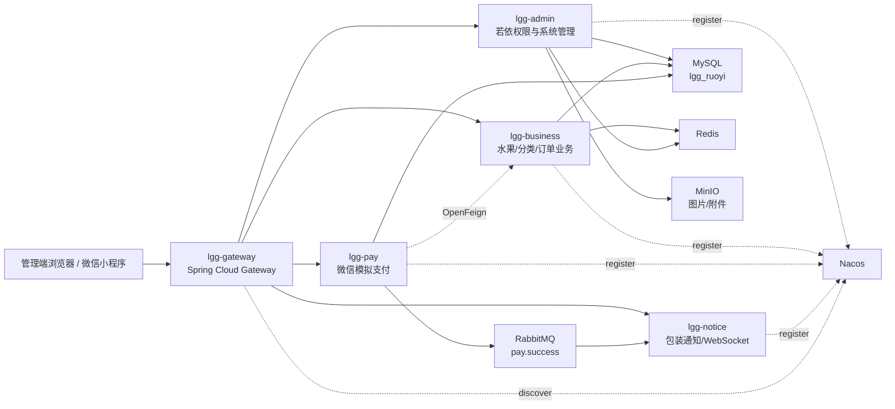

# 绿果果分布式架构技术选型

项目名：`springboot-lgg`

本文档定义第五组课程大作业最终版技术架构。当前优先目标是本地 PM2 现场演示稳定，架构表达上补齐分布式课程设计的关键技术点：服务注册、统一网关、服务调用、缓存、消息通知、对象存储、接口测试与端到端测试。

## 1. 选型结论

最终选型采用“轻量微服务 + 本地 PM2 守护 + 可选 Docker Compose”的双路线。

| 层级 | 技术 | 是否纳入本地演示 | 选型理由 |
| --- | --- | --- | --- |
| 管理后台 | RuoYi Vue3 + Element Plus | 是 | 管理端成熟，适合快速展示系统管理能力 |
| 后端基础 | Spring Boot | 是 | 课程核心技术，承载业务 API |
| 微服务治理 | Spring Cloud Alibaba Nacos | 是 | 课程分布式特征最直观，提供服务注册与配置中心截图 |
| 统一入口 | Spring Cloud Gateway | 是 | 体现统一网关、路由转发、接口聚合 |
| 服务调用 | OpenFeign | 是 | 体现服务间远程调用，避免“多个端口假拆分” |
| 权限管理 | RuoYi Security + JWT | 是 | 沿用若依权限体系，降低重构风险 |
| 数据库 | MySQL | 是 | 存储若依基础表与绿果果业务表 |
| 缓存 | Redis | 是 | 支撑验证码、登录态、缓存与热点数据 |
| 消息队列 | RabbitMQ | 轻量纳入 | 用于订单支付成功后的包装提醒事件 |
| 对象存储 | MinIO | 轻量纳入 | 替代 OSS，支持水果图片/文件上传演示 |
| 实时通知 | WebSocket | 是 | 管理端订单包装提醒，演示效果明显 |
| 健康检查 | Spring Boot Actuator | 是 | 每个服务提供 `/actuator/health`，便于截图和验收 |
| 接口测试 | Apifox CLI 或 Newman | 是 | 生成接口自动化测试报告 |
| E2E 测试 | Playwright | 是 | 自动化验证登录、菜单、订单等前端流程 |
| 进程管理 | PM2 | 是 | 本地守护 Java/Vue/Nacos 等服务，避免僵尸进程 |
| 容器化 | Docker Compose | 可选分支 | 用于报告加分和后续部署，不作为现场主路径 |

## 2. 架构总览

## 3. 服务拆分边界

本项目不做生产级大拆分，采用课程设计最稳的轻量拆分策略。

| 服务 | 端口 | 职责 | 演示接口 |
| --- | --- | --- | --- |
| `lgg-gateway` | `8090` | 统一入口、路由、跨域、鉴权转发 | `/actuator/health`、路由转发 |
| `lgg-admin` | `8081` | 若依登录、权限、菜单、系统管理 | `/captchaImage`、`/login`、系统菜单 |
| `lgg-business` | `8088` | 水果分类、水果品种、订单、购物车 | `/business/category/list`、订单查询 |
| `lgg-pay` | `8085` | 微信模拟支付、支付回调、订单状态联动 | `/pay/mock`、`/pay/callback` |
| `lgg-notice` | `8086` | WebSocket 包装提醒、异步通知消费 | `/notice/health`、WebSocket 推送 |
| `lgg-frontend` | `8082` | Vue3 管理端页面 | 管理端首页和业务菜单 |

数据库短期仍使用同一个 `lgg_ruoyi`，通过模块表和包结构隔离业务。课程报告中表述为“逻辑拆分、统一数据源、后续可演进为多库多服务”，避免为了拆库引入演示风险。

## 4. 本地 PM2 演示路线

本地演示不使用 Docker 作为主路径，所有长运行进程由 PM2 托管。

| PM2 进程 | 启动对象 | 备注 |
| --- | --- | --- |
| `lgg-nacos` | Nacos standalone | 展示服务注册中心 |
| `lgg-gateway` | Gateway jar | 统一入口 |
| `lgg-admin` | 若依后台 jar | 权限和系统管理 |
| `lgg-business` | 业务服务 jar | 绿果果核心业务 |
| `lgg-pay` | 支付服务 jar | 模拟支付闭环 |
| `lgg-notice` | 通知服务 jar | WebSocket/消息消费 |
| `lgg-frontend` | Vue3 dev/preview server | 管理端界面 |

现场演示优先级：

1. 打开 PM2 面板或 `pm2 status`，展示服务均在线。
2. 打开 Nacos 控制台，展示 `lgg-gateway`、`lgg-admin`、`lgg-business`、`lgg-pay`、`lgg-notice` 注册成功。
3. 访问 `http://localhost:8082` 登录绿果果管理端。
4. 展示水果分类、水果品种、订单管理。
5. 触发小程序下单和支付模拟。
6. 展示 RabbitMQ/服务日志中的支付成功事件。
7. 展示 WebSocket 管理端包装提醒。
8. 执行 Apifox CLI/Newman 接口测试报告。
9. 执行 Playwright 端到端测试截图。

## 5. Docker Compose 分支路线

`deploy/docker-compose` 分支作为高级部署路线，后续放置：

- `docker-compose.yml`
- 后端服务 Dockerfile
- 前端 Nginx Dockerfile
- MySQL、Redis、Nacos、RabbitMQ、MinIO 服务定义
- 健康检查和日志卷
- `.env.example`

该路线用于报告“部署方案与工程化扩展”章节，不作为答辩现场主路径。

## 6. 为什么不一次性上全套重型系统

| 技术 | 当前决策 | 原因 |
| --- | --- | --- |
| ELK | 暂不上 | 重量大，现场演示不稳定；用 logback + PM2 日志 + TraceId 替代 |
| Prometheus/Grafana | 暂不上 | 截图加分有限，实现成本高 |
| 多数据库拆分 | 暂不上 | 会显著增加数据一致性和初始化复杂度 |
| Kubernetes | 不上 | 超出课程作业必要范围 |
| 生产级支付 | 不上 | 课程演示采用微信模拟支付闭环即可 |

## 7. 报告表述口径

建议报告标题口径：

> 基于 Spring Boot 与 Spring Cloud Alibaba 的绿果果生鲜分布式运营系统设计与实现

摘要关键词：

> Spring Boot；Spring Cloud Alibaba；Nacos；Gateway；OpenFeign；Redis；RabbitMQ；MinIO；WebSocket；Vue3

核心论点：

- 本系统采用前后端分离与轻量微服务架构。
- 通过 Nacos 实现服务注册与发现。
- 通过 Gateway 统一对外暴露接口。
- 通过 OpenFeign 完成支付服务调用业务服务更新订单状态。
- 通过 RabbitMQ 解耦支付成功与包装通知。
- 通过 Redis 提升登录、验证码、缓存等场景性能。
- 通过 MinIO 完成本地对象存储替代真实 OSS。
- 通过 PM2 保证本地演示进程稳定。

## 8. 当前实施顺序

1. `main` 分支补齐 PM2 本地演示脚本与健康检查。
2. 新增 Nacos、Gateway、Actuator，先让服务注册和路由截图成立。
3. 拆出 `lgg-pay` 与 `lgg-notice` 两个轻服务，完成 pay 通过 OpenFeign 更新订单状态、RabbitMQ 投递事件、notice 消费并 WebSocket 推送的演示闭环。
4. 接入 MinIO，用于水果图片或文件上传演示。
5. 编写 Apifox CLI/Newman 接口测试集。
6. 编写 Playwright 管理端 E2E 测试。
7. `deploy/docker-compose` 分支补容器化一键部署。

## 9. 验收标准

- `pm2 status` 能看到本地演示服务在线。
- Nacos 控制台能看到至少 4 个服务实例。
- Gateway 能转发到后端业务接口。
- 至少一个 OpenFeign 调用链路可演示。
- RabbitMQ 至少有一个支付成功事件进入通知服务。
- MinIO 至少完成一次图片或文件上传。
- 每个核心服务有 `/actuator/health`。
- Apifox CLI/Newman 生成接口测试报告。
- Playwright 生成管理端演示截图。
